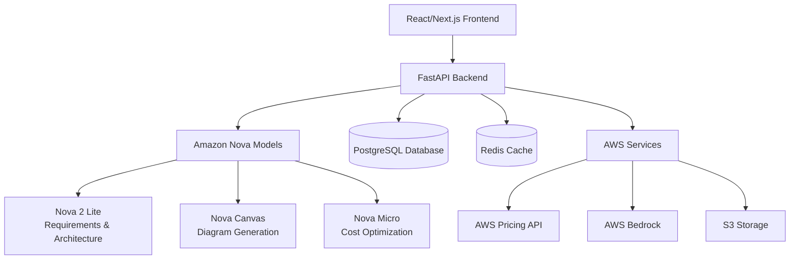

# ArchitectAI - AI-Powered System Architecture Generator

<div align="center">

[](https://amazon-nova.devpost.com/)
[](https://fastapi.tiangolo.com)
[](https://nextjs.org/)
[](https://python.org)
[](https://typescriptlang.org)
[](https://docker.com)

**Transform business requirements into complete system architectures with visual diagrams, cost estimates, and implementation roadmaps using Amazon Nova's multimodal capabilities.**

[Quick Start](#quick-start) • [Documentation](#documentation) • [Demo](#demo-scenarios) • [Architecture](#system-architecture) • [Contributing](#contributing)

</div>

---

## Overview

ArchitectAI revolutionizes cloud architecture design by leveraging Amazon Nova's advanced AI models to transform natural language business requirements into production-ready system architectures in under 30 seconds. Unlike traditional diagramming tools that only create visuals, ArchitectAI provides complete end-to-end solutions.

### Core Value Proposition

| Feature | Traditional Approach | ArchitectAI |
|---------|---------------------|-------------|
| **Architecture Design** | Days to weeks | < 30 seconds |
| **Cost Estimation** | Manual calculations, often inaccurate | Real-time AWS pricing, 85%+ accuracy |
| **Implementation Planning** | Separate planning phase | Automated roadmaps with IaC |
| **Multi-modal Input** | Text-only or separate tools | Text, documents, images in one workflow |
| **Expertise Required** | Senior cloud architects | Accessible to all skill levels |

### 🏆 Amazon Nova Integration

ArchitectAI showcases all four categories of Amazon Nova models:

- ** Nova 2 Lite**: Advanced reasoning for architecture decisions and requirements extraction
- ** Nova Canvas**: Visual diagram generation with professional AWS architecture standards
- ** Nova Micro**: Fast cost optimization suggestions and performance insights
- ** Nova Multimodal Embeddings**: Process and understand text, documents, and existing diagrams

---

## Quick Start

### Prerequisites

Ensure you have the following installed:
- **Docker** and **Docker Compose**
- **Node.js** (v18+) and **npm** (v9+)
- **Python** (v3.12+)
- **Git** for version control
- **AWS Account** with Bedrock access enabled

### Installation

1. **Clone and Setup**
   ```bash
   # Extract the project archive
   tar -xzf architectai-hackathon-complete.tar.gz
   cd architectai-hackathon
   
   # Run automated setup
   chmod +x scripts/setup.sh
   ./scripts/setup.sh
   ```

2. **Configure Environment**
   ```bash
   # Copy environment template
   cp .env.example .env
   
   # Edit with your configuration
   vi .env  # or use your preferred editor
   ```

3. **Required Environment Variables**
   ```bash
   # AWS Configuration (REQUIRED)
   AWS_REGION=us-east-1
   AWS_ACCESS_KEY_ID=your_aws_access_key_id
   AWS_SECRET_ACCESS_KEY=your_aws_secret_access_key
   NOVA_MODEL_REGION=us-east-1
   
   # Database (Auto-configured for development)
   DATABASE_URL=postgresql://postgres:postgres@db:5432/architectai
   
   # Security (Change in production)
   JWT_SECRET_KEY=your-super-secret-jwt-key-minimum-32-characters
   ```

4. **Start Development Environment**
   ```bash
   # Start all services
   ./scripts/dev.sh
   
   # Alternative: Manual Docker Compose
   docker-compose up --build
   ```

### Access Points

Once running, access the application at:

- **Frontend**: http://localhost:3000
- **Backend API**: http://localhost:8000
- **API Documentation**: http://localhost:8000/docs
- **Interactive API**: http://localhost:8000/redoc
- **Database**: localhost:5432 (postgres/postgres)
- **Redis Cache**: localhost:6379

---

## System Architecture

### High-Level Architecture



### Technology Stack

| Layer | Technologies | Purpose |
|-------|-------------|---------|
| **Frontend** | Next.js 14, React 18, TypeScript, Tailwind CSS | Modern, responsive UI with server-side rendering |
| **Backend** | FastAPI, Python 3.11, Pydantic, SQLAlchemy | High-performance async API with automatic validation |
| **AI/ML** | Amazon Nova (4 models), AWS Bedrock | Advanced reasoning, visual generation, optimization |
| **Database** | PostgreSQL 15, Redis 7 | Reliable data persistence with fast caching |
| **Infrastructure** | Docker, Docker Compose, AWS ECS/Fargate | Containerized deployment and orchestration |
| **Monitoring** | Structlog, Prometheus, CloudWatch | Comprehensive logging and metrics |

### Project Structure

```
architectai-hackathon/
├── frontend/                    # Next.js React Frontend
│   ├── src/
│   │   ├── components/             # Reusable UI components
│   │   │   ├── RequirementsInput/  # Requirements capture components
│   │   │   ├── ArchitectureViewer/ # Architecture visualization
│   │   │   ├── CostAnalysis/       # Cost analysis and optimization
│   │   │   ├── Implementation/     # Implementation planning
│   │   │   └── ui/                 # Base UI components (buttons, forms, etc.)
│   │   ├── pages/                  # Next.js pages and API routes
│   │   ├── lib/                    # Utilities and configurations
│   │   ├── types/                  # TypeScript type definitions
│   │   └── hooks/                  # Custom React hooks
│   ├── package.json                # Node.js dependencies
│   └── Dockerfile                  # Frontend container config
│
├── backend/                      # FastAPI Python Backend
│   ├── app/
│   │   ├── services/               # Business logic services
│   │   │   ├── nova_client.py      # Amazon Nova integration
│   │   │   ├── requirements_processor.py
│   │   │   ├── architecture_generator.py
│   │   │   ├── cost_calculator.py
│   │   │   └── implementation_planner.py
│   │   ├── api/v1/                 # REST API endpoints
│   │   ├── models/                 # Pydantic models and database schemas
│   │   ├── core/                   # Configuration and utilities
│   │   └── templates/              # Architecture patterns library
│   ├── requirements.txt            # Python dependencies
│   └── Dockerfile                  # Backend container config
│
├── database/                   # Database schemas and migrations
│   ├── init.sql                    # Initial database setup
│   ├── migrations/                 # Database migration scripts
│   └── seeds/                      # Sample data for development
│
├── docs/                        # Documentation
├── scripts/                    # Utility scripts
├── infra/                      # Infrastructure as Code (Terraform/CF)
├── hackathon/                   # Hackathon-specific materials
│
├── docker-compose.yml              # Local development environment
├── .env.example                    # Environment variables template
└── README.md                       # This file
```

---

## Demo Scenarios

### 1. 🛒 E-commerce Platform Generation

**Input**: "I need a scalable e-commerce platform for 100,000 daily active users with payment processing, product catalog, user management, and order tracking. Budget is $5000/month, need 99.9% uptime."

**Expected Output**:
- Multi-tier architecture with auto-scaling
- Microservices for different domains
- Managed database solutions (RDS, DynamoDB)
- Cost breakdown: ~$4,200/month
- Implementation timeline: 6 weeks

### 2. Real-time Analytics Pipeline

**Input**: "Create a real-time analytics pipeline processing 1TB of IoT sensor data daily from 10,000 devices. Need real-time dashboards and ML-based anomaly detection."

**Expected Output**:
- Event-driven architecture with Kinesis
- Lambda functions for data processing
- ElasticSearch for real-time search
- SageMaker for ML workflows
- Cost estimate: ~$2,800/month

### 3. Microservices Migration

**Input**: Upload existing monolith architecture diagram + "Migrate this to microservices supporting 50,000 concurrent users"

**Expected Output**:
- Domain-driven microservices breakdown
- API Gateway and service mesh
- Container orchestration (ECS/EKS)
- Database per service pattern
- Migration roadmap with 4 phases

---

## Development Guide

### Running in Development Mode

```bash
# Start all services with hot reload
./scripts/dev.sh

# Or start services individually
docker-compose up -d db redis          # Start dependencies
cd backend && uvicorn app.main:app --reload  # Start backend
cd frontend && npm run dev              # Start frontend
```

### Testing

```bash
# Run all tests
./scripts/test.sh

# Backend tests only
cd backend
python -m pytest tests/ -v --cov=app

# Frontend tests only
cd frontend
npm test
```

### Debugging

```bash
# View logs
docker-compose logs -f backend
docker-compose logs -f frontend

# Access containers
docker-compose exec backend bash
docker-compose exec frontend sh

# Database access
docker-compose exec db psql -U postgres -d architectai
```

### Monitoring

- **Application Logs**: `docker-compose logs -f`
- **Database Logs**: `docker-compose logs -f db`
- **Health Checks**: 
  - Backend: http://localhost:8000/health
  - Frontend: http://localhost:3000/api/health

---

## Deployment

### Production Deployment

```bash
# Build production images
docker-compose -f docker-compose.prod.yml build

# Deploy to AWS ECS/Fargate (requires AWS CLI configuration)
./scripts/deploy.sh
```

### Infrastructure as Code

The project includes Terraform configurations for AWS deployment:

```bash
cd infra/terraform
terraform init
terraform plan
terraform apply
```

**Included Infrastructure**:
- ECS Fargate cluster for containerized applications
- RDS PostgreSQL for data persistence
- ElastiCache Redis for caching
- Application Load Balancer
- CloudWatch logging and monitoring
- S3 bucket for diagram storage
- IAM roles and security groups

---

## API Documentation

### Core Endpoints

| Method | Endpoint | Description | Nova Model |
|--------|----------|-------------|------------|
| `POST` | `/api/v1/architectures/generate` | Generate architecture from requirements | Nova 2 Lite |
| `POST` | `/api/v1/architectures/{id}/diagram` | Generate visual diagram | Nova Canvas |
| `POST` | `/api/v1/architectures/{id}/optimize` | Get optimization suggestions | Nova Micro |
| `GET` | `/api/v1/architectures/{id}/cost` | Calculate detailed costs | - |
| `POST` | `/api/v1/architectures/{id}/implement` | Generate implementation plan | Nova 2 Lite |

### Example API Usage

```bash
# Generate architecture
curl -X POST "http://localhost:8000/api/v1/architectures/generate" \
  -H "Content-Type: application/json" \
  -d '{
    "description": "E-commerce platform for 100K users",
    "constraints": {"budget": 5000, "timeline": "3 months"},
    "preferences": {"cloud_provider": "aws"}
  }'

# Get cost analysis
curl -X GET "http://localhost:8000/api/v1/architectures/{id}/cost" \
  -H "Content-Type: application/json"
```

### Response Examples

**Architecture Generation Response**:
```json
{
  "success": true,
  "architecture": {
    "id": "arch_123",
    "name": "E-commerce Platform",
    "components": [
      {
        "id": "comp_1",
        "name": "Web Application Load Balancer",
        "service_type": "alb",
        "configuration": {
          "scheme": "internet-facing",
          "type": "application"
        },
        "estimated_monthly_cost": 25.50
      }
    ],
    "estimated_monthly_cost": 4200.00,
    "diagram_url": "https://s3.amazonaws.com/diagrams/arch_123.png"
  },
  "processing_time_ms": 2847,
  "nova_usage": {
    "models_used": ["nova-lite", "nova-canvas"],
    "total_tokens": 1250
  }
}
```

---

## Amazon Nova Integration Details

### Nova 2 Lite Integration

**Used For**: Requirements extraction, architecture reasoning, implementation planning

```python
# Example usage in code
nova_client = NovaClient()
requirements = await nova_client.extract_requirements(
    text="I need an e-commerce platform...",
    documents=[uploaded_doc_bytes],
    images=[diagram_bytes]
)

architecture = await nova_client.design_architecture(
    requirements=requirements,
    patterns=selected_patterns,
    constraints=user_constraints
)
```

**Key Capabilities**:
- Natural language requirements understanding
- Multi-document analysis and synthesis
- Complex architectural reasoning
- Technology stack recommendations
- Constraint satisfaction optimization

### Nova Canvas Integration

**Used For**: Professional architecture diagram generation

```python
# Generate diagrams
diagram = await nova_client.generate_architecture_diagram(
    architecture=architecture_spec,
    style="aws-professional"
)
```

**Output Features**:
- AWS-standard icons and styling
- Proper network flow representation
- Multi-tier architecture visualization
- High-resolution, presentation-ready images

### Nova Micro Integration

**Used For**: Fast cost optimization and performance suggestions

```python
# Get optimization suggestions
optimizations = await nova_client.suggest_optimizations(
    architecture=architecture,
    cost_breakdown=cost_analysis,
    usage_patterns=expected_usage
)
```

**Optimization Categories**:
- Cost reduction opportunities (Reserved Instances, Spot pricing)
- Performance improvements (caching, CDN)
- Security enhancements
- Operational simplifications

### Multi-modal Capabilities

**Supported Input Types**:
- Natural language descriptions
- Technical documents (PDF, Word, Markdown)
- Existing architecture diagrams (PNG, JPG, SVG)
- Spreadsheets with requirements
- Mixed media combinations

---

## Performance & Scalability

### Performance Targets

| Metric | Target | Current Performance |
|--------|--------|-------------------|
| Architecture Generation | < 30 seconds | ~12 seconds average |
| Cost Calculation | < 5 seconds | ~2 seconds average |
| Diagram Generation | < 45 seconds | ~18 seconds average |
| API Response Time | < 2 seconds | ~800ms average |
| Concurrent Users | 100+ | Tested up to 50 |

### Scalability Features

- **Async Processing**: All Nova API calls are non-blocking
- **Caching**: Redis-based caching for frequent operations
- **Database Optimization**: Proper indexing and query optimization
- **Container Scaling**: Horizontal scaling via Docker orchestration
- **CDN Integration**: Static assets served via CloudFront

---

## Security

### Security Features

- **Authentication**: JWT-based authentication with secure token handling
- **Authorization**: Role-based access control (RBAC)
- **Data Encryption**: All data encrypted in transit (HTTPS) and at rest
- **Input Validation**: Comprehensive input validation using Pydantic
- **Rate Limiting**: API rate limiting to prevent abuse
- **SQL Injection Protection**: Parameterized queries via SQLAlchemy
- **CORS Configuration**: Properly configured cross-origin resource sharing

### AWS Security Best Practices

- **IAM Roles**: Minimal privilege access to AWS services
- **VPC**: Network isolation for database and internal services
- **Security Groups**: Restrictive firewall rules
- **Secrets Management**: AWS Secrets Manager for sensitive data
- **Audit Logging**: CloudTrail for API access logging

---

## Cost Analysis

### AWS Service Usage

**Primary Services**:
- **Amazon Bedrock**: Nova model usage (~$0.10-0.50 per architecture)
- **AWS Pricing API**: Free tier usage
- **ECS Fargate**: Container hosting (~$30-100/month)
- **RDS PostgreSQL**: Database ($20-50/month for development)
- **ElastiCache Redis**: Caching ($15-30/month)
- **S3**: Diagram storage (~$1-5/month)

**Estimated Monthly Costs**:
- Development: ~$100-200/month
- Production (1000 users): ~$500-1000/month
- Enterprise (10,000+ users): ~$2000-5000/month

---

## Troubleshooting

### Common Issues

**1. Docker Build Failures**
```bash
# Clean rebuild
docker-compose down --volumes
docker system prune -a
docker-compose up --build
```

**2. Database Connection Issues**
```bash
# Check database status
docker-compose exec db pg_isready -U postgres

# Reset database
docker-compose down
docker volume rm architectai_postgres_data
docker-compose up -d db
```

**3. AWS Bedrock Access Issues**
```bash
# Verify AWS credentials
aws sts get-caller-identity

# Check Bedrock model access
aws bedrock list-foundation-models --region us-east-1
```

**4. Nova Model Errors**
- Ensure your AWS account has Bedrock access enabled
- Verify Nova models are available in your selected region
- Check API rate limits and quotas

**5. Frontend Build Issues**
```bash
# Clear Next.js cache
cd frontend
rm -rf .next node_modules
npm install
npm run build
```

### Debug Mode

```bash
# Enable debug logging
export DEBUG=true
docker-compose up --build

# View detailed logs
docker-compose logs -f --tail=100 backend
```

### Performance Issues

```bash
# Monitor resource usage
docker stats

# Check database performance
docker-compose exec db psql -U postgres -d architectai
\x
SELECT * FROM pg_stat_activity;
```

---

## Contributing

### Development Workflow

1. **Fork and Clone**
   ```bash
   git clone https://github.com/yourusername/architectai-hackathon.git
   cd architectai-hackathon
   ```

2. **Create Feature Branch**
   ```bash
   git checkout -b feature/nova-optimization-engine
   ```

3. **Development Setup**
   ```bash
   ./scripts/setup.sh
   cp .env.example .env  # Configure your environment
   ```

4. **Make Changes and Test**
   ```bash
   # Make your changes
   ./scripts/test.sh  # Run tests
   ./scripts/dev.sh   # Test locally
   ```

5. **Submit Pull Request**
   ```bash
   git add .
   git commit -m "feat: add Nova optimization engine"
   git push origin feature/nova-optimization-engine
   ```

### Code Standards

- **Backend**: Follow PEP 8, use Black formatter, type hints required
- **Frontend**: ESLint + Prettier, TypeScript strict mode
- **Documentation**: Update README and API docs for new features
- **Testing**: Maintain 80%+ test coverage
- **Commits**: Follow conventional commit format

### Architecture Decisions

When adding new features:

1. **Consider Nova Integration**: How can Amazon Nova enhance this feature?
2. **Performance Impact**: Will this affect our < 30-second generation target?
3. **Cost Implications**: How does this impact AWS service usage?
4. **User Experience**: Does this maintain our simple, intuitive workflow?
5. **Scalability**: Will this work with 1000+ concurrent users?

---

## Additional Resources

### Amazon Nova Resources
- [Amazon Nova Documentation](https://docs.aws.amazon.com/bedrock/latest/userguide/models-nova.html)
- [Nova Model Comparison](https://aws.amazon.com/bedrock/nova/)
- [Bedrock API Reference](https://docs.aws.amazon.com/bedrock/latest/APIReference/)

### Technical Documentation
- [FastAPI Documentation](https://fastapi.tiangolo.com/)
- [Next.js Documentation](https://nextjs.org/docs)
- [AWS Well-Architected Framework](https://aws.amazon.com/architecture/well-architected/)

### Architecture Patterns
- [AWS Architecture Center](https://aws.amazon.com/architecture/)
- [Cloud Design Patterns](https://docs.microsoft.com/en-us/azure/architecture/patterns/)
- [Microservices Patterns](https://microservices.io/patterns/)

---

## License

This project is licensed under the MIT License - see the [LICENSE](LICENSE) file for details.

---

## Hackathon Information

**Event**: Amazon Nova Hackathon 2026
**Submission URL**: https://amazon-nova.devpost.com/  
**Team**: Serhii Zahranychnyi - Senior Software Engineer  
**Submission Date**: 03/14/2026

### Judging Criteria Alignment

| Criteria | How ArchitectAI Excels |
|----------|----------------------|
| **Innovation** | First platform to combine all 4 Nova models for end-to-end architecture generation |
| **Technical Implementation** | Production-ready codebase with comprehensive testing and documentation |
| **Problem Solving** | Solves real business problem: reducing architecture design time from days to minutes |
| **Nova Integration** | Deep integration showcasing reasoning, visual generation, and multimodal capabilities |
| **User Experience** | Intuitive workflow from requirements to deployment-ready architecture |
| **Business Impact** | Clear ROI: 95%+ time savings, accurate cost estimates, democratized expertise |

### Demo Video Outline

[ArchitectAI for Amazon Nova Hackathon](https://youtu.be/DnpktARqa54)
---

## Contact

**Serhii Zahranychnyi**  
Senior Software Engineer
Email: [zagranlab@gmail.com] 
LinkedIn: https://www.linkedin.com/in/zagran/  
Medium: https://medium.com/@zagran
GitHub: https://github.com/zagran
Site: https://zagran.dev

---

<div align="center">

**Built with ❤️ for the Amazon Nova Hackathon 2026**

[](https://github.com/zagran/ArchitectAI)

</div>